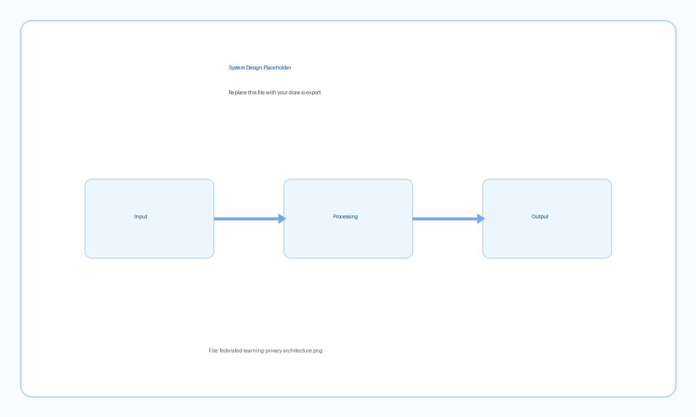

# System Design Gallery

This section is reserved for architecture and system design visuals for each project.  
Export your draw.io diagrams as PNG/SVG and place them under `assets/diagrams/`.

<div class="card-grid">
  <div class="card">
    <h3>Breakdown Recommendation System</h3>
    <p class="meta">Ingestion -> Retrieval -> LLM Reasoning -> Feedback Loop</p>
    
    <p class="meta">Replace with: <code>assets/diagrams/recommendation-system-architecture.png</code></p>
  </div>
  <div class="card">
    <h3>Cycle Time Reduction Pipeline</h3>
    <p class="meta">Bench Data -> Feature Engineering -> Model -> Validation Gate</p>
    
    <p class="meta">Replace with: <code>assets/diagrams/cycle-time-model-architecture.png</code></p>
  </div>
  <div class="card">
    <h3>Leadership Review Chatbot</h3>
    <p class="meta">MES DB -> KPI Logic Layer -> API -> Conversational Interface</p>
    
    <p class="meta">Replace with: <code>assets/diagrams/leadership-review-chatbot-architecture.png</code></p>
  </div>
  <div class="card">
    <h3>FMR OCR Data Pipeline</h3>
    <p class="meta">PDF Source -> OCR/Parsing -> Structured Data -> Power BI</p>
    
    <p class="meta">Replace with: <code>assets/diagrams/fmr-data-pipeline-architecture.png</code></p>
  </div>
  <div class="card">
    <h3>Secure On-Prem OCR Tool</h3>
    <p class="meta">Internal UI -> OCR Engine -> Secure Deployment Service</p>
    
    <p class="meta">Replace with: <code>assets/diagrams/secure-ocr-tool-architecture.png</code></p>
  </div>
  <div class="card">
    <h3>LLM Validation Framework</h3>
    <p class="meta">Toxicity Gate -> Retrieval -> Judge Agent -> PASS/FAIL Output</p>
    
    <p class="meta">Replace with: <code>assets/diagrams/llm-validation-framework-architecture.png</code></p>
  </div>
  <div class="card">
    <h3>Federated Learning Privacy Design</h3>
    <p class="meta">Client Training -> FedAvg -> Attack Evaluation -> DP Defense</p>
    
    <p class="meta">Replace with: <code>assets/diagrams/federated-learning-privacy-architecture.png</code></p>
  </div>
  <div class="card">
    <h3>Helmet Detection System</h3>
    <p class="meta">CCTV Stream -> Detection -> Plate Logging -> Incident Report</p>
    
    <p class="meta">Replace with: <code>assets/diagrams/helmet-detection-architecture.png</code></p>
  </div>
  <div class="card">
    <h3>Tokyo Olympics Analytics Workflow</h3>
    <p class="meta">Dataset Ingestion -> EDA -> Visualization -> Insight Summary</p>
    
    <p class="meta">Replace with: <code>assets/diagrams/tokyo-olympics-analytics-workflow.png</code></p>
  </div>
</div>

---

## How to Add Future Diagrams

1. Export from draw.io as PNG or SVG.
2. Save files into `assets/diagrams/`.
3. Replace each placeholder image with your real exported diagram:

```markdown

```
